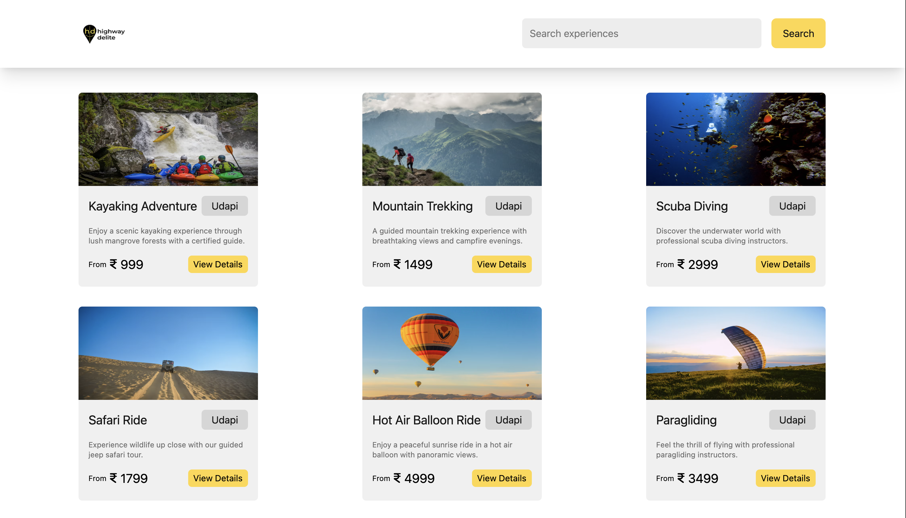
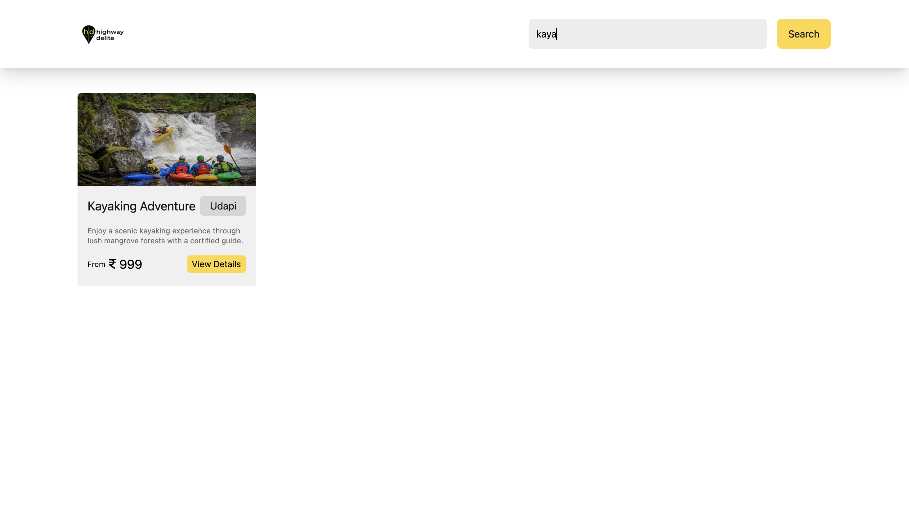
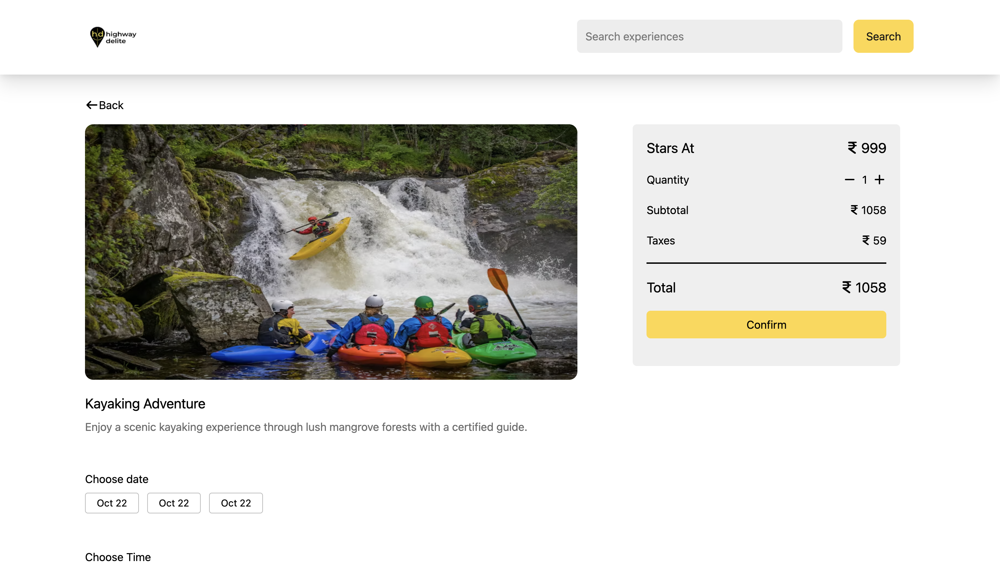
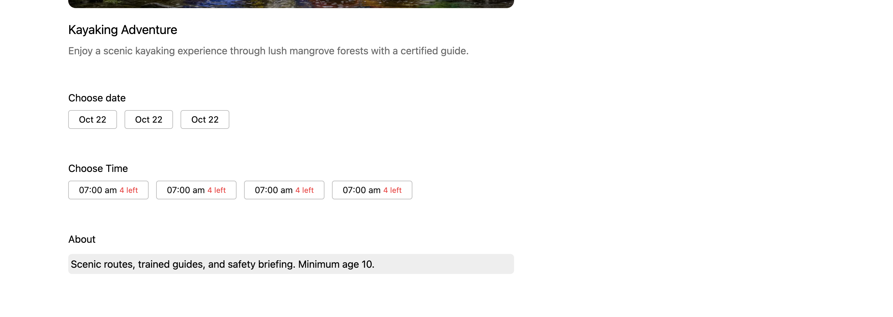
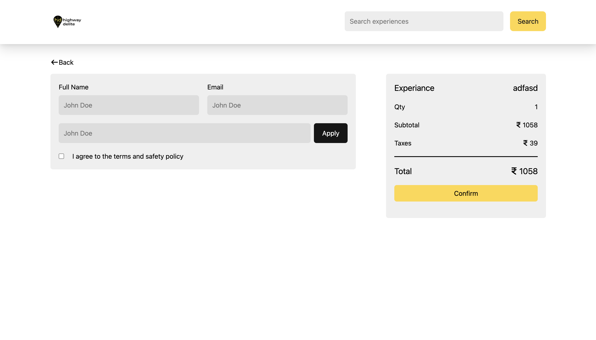
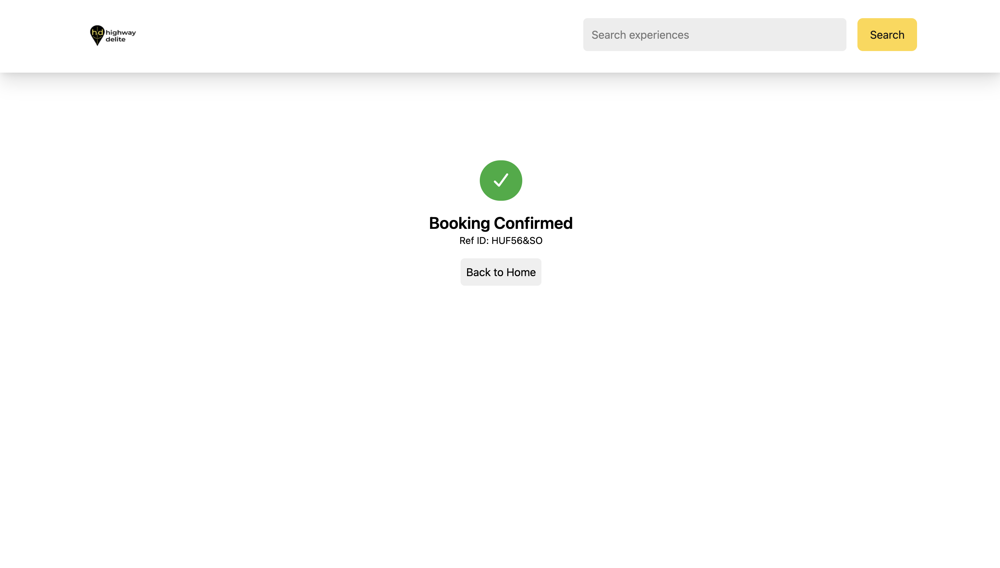

# Highway Delight

## About the project

This project is an Booking platform

- **User Control**:
  - User can see all listings, details listing,
  - User can select date and time slote,
  - User can book 

---

## 🌐 Live Demo
🔗 [View Live Project](https://highway-delight-1.onrender.com)

---

## Installation 

To set up the Airbnb on your local machine, follow these steps:

1. **Clone the Repository**:
    ```bash
    git clone https://github.com/warsi0707/Highway-delight
    ```

2. **Install Dependecies**:
    ```bash
    cd backend
    npm install

    cd frontend
    npm install
    ```

3. **Run the Application**:
    ```
    backend
    npm start

    frontend
    npm run dev
    ```

---

## Technologies Used

- **Frontend**:
  - React.js: For building the user interface.
  - React-Router: For navigation.
  - Redux - State management
  - Tailwind CSS: For styling components.
  - Local storage


- **Backend**:
  - Node.js: For server-side logic.
  - Express.js: For building the RESTful API.

- **Database**:
  - Mongoose: For storing user and transaction data.

- **Authentication**:

- **Others**:
  - Fetch: For making HTTP requests.
  - dotenv: For managing environment variables.

---

## Screenshots

### Homepage


### Listing By Search


### Listing details


### Listing details 2


### Checkout


### Booking



